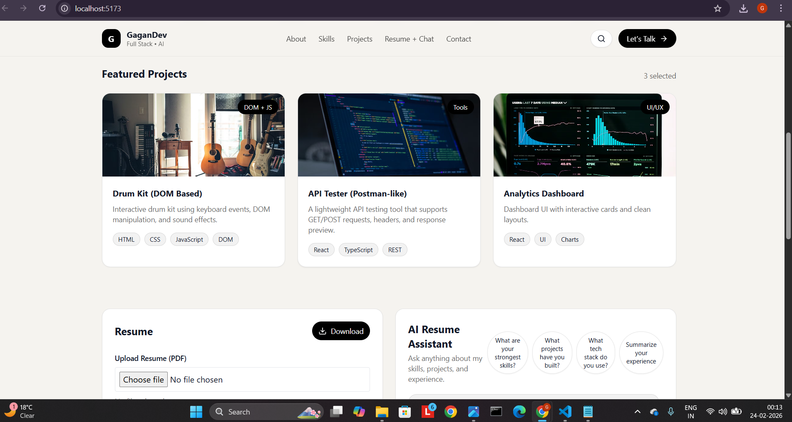
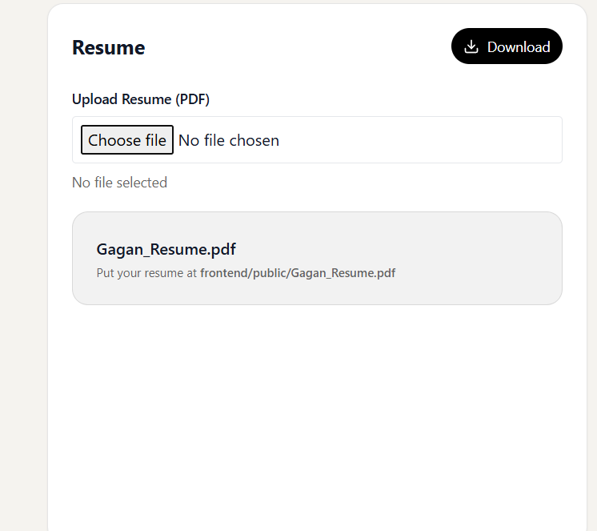
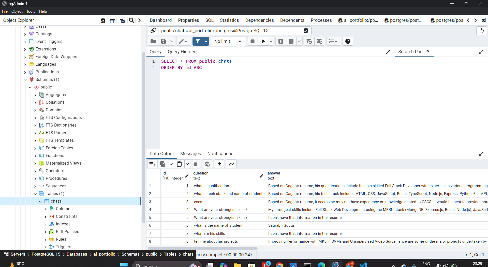

# AI Portfolio with Resume Chat

This project is a full stack personal portfolio website that includes an AI chat assistant which answers questions based on my resume.

The goal of this project was to build a modern portfolio with AI functionality using React, FastAPI, and database integration while maintaining a clean UI and structured backend.

This project was built as part of an internship assignment to demonstrate frontend design skills, backend development, and AI integration.

---

##  Project Overview

This portfolio allows users to:

- View my skills and projects
- Upload a resume (PDF)
- Download resume
- Ask questions about my experience using AI
- Store chat history in database

The AI assistant uses OpenRouter API and generates responses based on resume content.

---

##  Features

- Modern portfolio UI with responsive design
- AI resume assistant chat
- Resume upload functionality
- Resume download option
- Chat history stored in database
- REST API backend
- Clean UI/UX design

---

##  Tech Stack

### Frontend
- React with TypeScript
- TailwindCSS
- Axios
- Vite

### Backend
- Python FastAPI
- OpenRouter API (AI model)
- PDF processing (pdfplumber)

### Database
- PostgreSQL
- SQLAlchemy ORM

---

##  Project Structure (ASCII Folder Tree)
ai-portfolio/
│
├── backend/
│ │
│ ├── main.py # FastAPI server
│ ├── database.py # Database connection setup
│ ├── models.py # Database models
│ ├── requirements.txt # Python dependencies
│ ├── .env # API keys & environment variables
│ └── venv/ # Virtual environment
│
├── frontend/
│ │
│ ├── public/
│ │ └── Gagan_Resume.pdf # Resume file for download
│ │
│ ├── src/
│ │ ├── App.tsx # Main UI and logic
│ │ ├── main.tsx # React entry file
│ │ └── index.css
│ │
│ ├── screenshots/ # Project screenshots
│ │ ├── Ai-ResumeChat.png
│ │ ├── database_behindTheScen.png
│ │ ├── send-message.png
│ │ ├── ui-glimpse.png
│ │ ├── ui-glimse2.png
│ │ └── upload-resume.png
│ │
│ ├── package.json
│ ├── tailwind.config.js
│ └── vite.config.ts
│
└── README.md

---

## Screenshots

### Portfolio UI

### AI Resume Chat

### Resume Upload Feature

### Contact / Message Section

### Database Storage (Backend)

### UI Glimpse 2

##  Installation & Setup

### 1️⃣ Clone Repository
git clone https://github.com/gagankukalwork/ai-portfolio.git

cd ai-portfolio

---

### 2️⃣ Backend Setup
cd backend
python -m venv venv
venv\Scripts\activate

pip install fastapi uvicorn sqlalchemy psycopg2-binary python-dotenv requests pdfplumber

uvicorn main:app --reload

Backend runs at:http://127.0.0.1:8000/

---

### 3️⃣ Frontend Setup
cd frontend
npm install
npm run dev

Frontend runs at:http://localhost:5173/

---

##  Resume Features

- Upload resume PDF
- Extract text using pdfplumber
- AI uses resume data for answers
- Download resume directly from portfolio

---

##  Assignment Goal

Create a good looking portfolio with AI chat functionality.

This project demonstrates:

- Full stack development
- AI integration
- Backend architecture
- Database usage
- UI/UX design

---

##  Author

Gagan Kukal  
 gagankuakwork@gmail.com  
9599823239  
 India (Remote)

---

## 🏁 Status

 Completed for Internship Assignment

